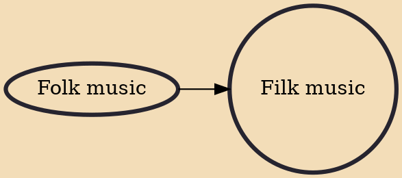

Filk music is a musical culture, genre, and community tied to science fiction, fantasy, and horror fandom and a type of fan labor. The genre has existed since the early 1950s and been played primarily since the mid-1970s.

## Influences
- [[Folk music]]
