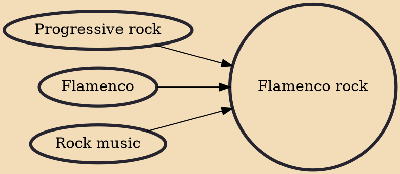

Flamenco rock or Andalusian rock is a rock music subgenre that emerged from (but is not limited to) the Spanish region of Andalusia throughout the late 1960s and early 1970s. There were some precedents like a couple of albums (Rock encounter and The Soul of Flamenco and the Essence of Rock) by Sabicas, a handful of singles by Smash, Gong, Galaxia, Flamenco or even the American band Carmen. However, Triana was recognized as a pioneer of the genre since their music focuses on a homogeneous fusion of the progressive rock and flamenco. Many bands that mixed progressive and symphonic rock with flamenco followed them such as Imán Califato independiente, Cai, Guadalquivir, Alameda or Mezquita; that's why the term Andalusian rock may be understood simply as flamenco prog.

## Influences
- [[Progressive rock]]
- [[Flamenco]]
- [[Rock music]]
