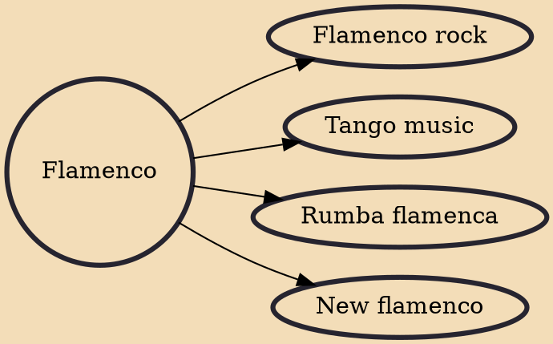

Flamenco (Spanish pronunciation: [flaˈmeŋko]), in its strictest sense, is an art form based on the various folkloric music traditions of southern Spain, developed within the gitano subculture of the region of Andalusia, but also having a historical presence in Extremadura and Murcia. In a wider sense, it is a portmanteau term used to refer to a variety of both contemporary and traditional musical styles typical of southern Spain. Flamenco is closely associated to the gitanos of the Romani ethnicity who have contributed significantly to its origination and professionalization. However, its style is uniquely Andalusian and flamenco artists have historically included Spaniards of both gitano and non-gitano heritage.

## Derivatives
- [[Flamenco rock]]
- [[Tango music]]
- [[Rumba flamenca]]
- [[New flamenco]]
