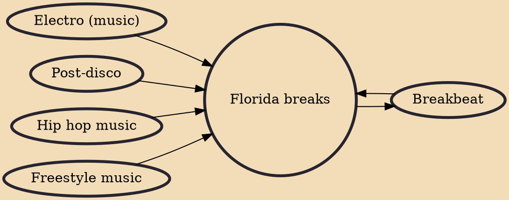

Florida breaks, which may also be referred to as The Orlando Sound, Orlando breaks, or The Breaks, is a genre of breakbeat dance music that originated in the central region of the State of Florida, United States.Florida Breaks originates from a mixture of hip-hop, Miami bass and electro that often includes recognizable sampling of early jazz or funk beats from rare groove or popular film. Florida's breakbeat style feature vocal elements and retains the hip-hop rhythms on which is based. The Florida breakbeat style however is faster, more syncopated, and has a heavier and unrelenting bassline. The beat frequently slows and breaks down complex beat patterns and then rebuilds. The genre has been described as being easy to dance to while creating an uplifting, happy, or positive mood in the li

## Influences

- [[Electro (music)]]
- [[Post-disco]]
- [[Breakbeat]]
- [[Hip hop music]]
- [[Freestyle music]]

## Derivatives

- [[Breakbeat]]
