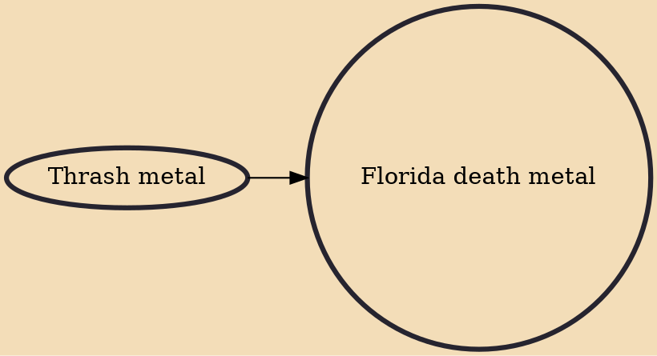

Florida death metal is a regional scene and stylistic subdivision of death metal. Some of the most significantly pioneering and best-selling death metal acts emerged in Florida, especially in the Tampa Bay area. As a result, Tampa is unofficially known by many death metal fans as the "capital of death metal." The scene coalesced in the mid-1980s through early 1990s around the output of bands such as Death, Nasty Savage, Deicide, Monstrosity, Morbid Angel, Atheist, Obituary, and others. The producer Scott Burns and the studio Morrisound Recording were also instrumental in developing and popularizing the Florida scene. Some bands which originated outside of Florida, such as Malevolent Creation and Cannibal Corpse, relocated to the state in order to participate in this burgeoning scene. The F

## Influences
- [[Thrash metal]]
