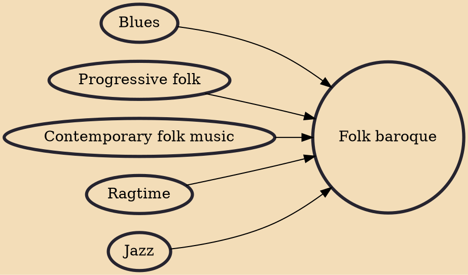

Folk baroque or baroque guitar, and also sometimes called chamber folk, is a distinctive and influential guitar fingerstyle developed in Britain in the 1960s, which combined elements of American folk, blues, jazz and ragtime with British folk music to produce a new and elaborate form of accompaniment. It has been highly important in folk music, folk rock and British folk rock playing, particularly in Britain, Ireland, North America and France.

## Influences
- [[Blues]]
- [[Progressive folk]]
- [[Contemporary folk music]]
- [[Ragtime]]
- [[Jazz]]
