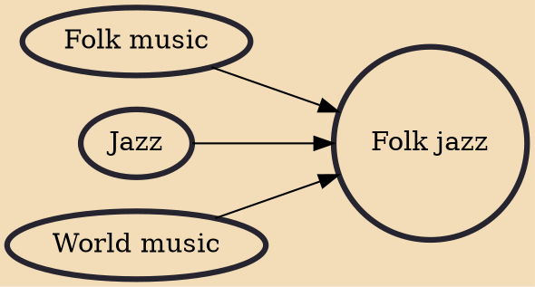

Folk jazz is a musical style that combines traditional folk music with elements of jazz, usually featuring richly texturized songs. Its origins can be traced back to the 1950s, when artists like Jimmy Giuffre and Tony Scott pursued distinct approaches to folk music production, initially, as a vehicle for soloist expression.

## Influences

- [[Folk music]]
- [[Jazz]]
- [[World music]]
