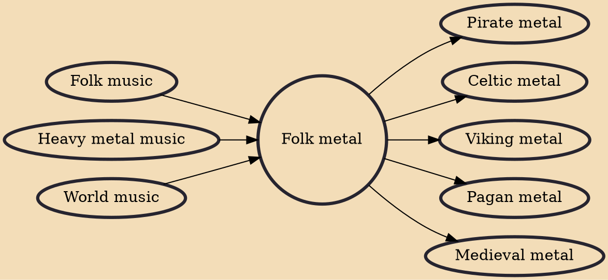

Folk metal is a fusion genre of heavy metal music and traditional folk music that developed in Europe during the 1990s. It is characterised by the widespread use of folk instruments and, to a lesser extent, traditional singing styles (for example, Dutch Heidevolk, Danish Sylvatica and Spanish Stone of Erech). It also sometimes features soft instrumentation influenced by folk rock.

## Influences

- [[Folk music]]
- [[Heavy metal music]]
- [[World music]]

## Derivatives

- [[Pirate metal]]
- [[Celtic metal]]
- [[Viking metal]]
- [[Pagan metal]]
- [[Medieval metal]]
