```dot
digraph {
	graph [bgcolor="#F3DDB8" rankdir=LR]
	node [color="#26242F" penwidth=3.0]
	"Folk music" [shape=circle]
	"Starogradska muzika" [URL="/starogradska-muzika/"]
	"Starogradska muzika" -> "Folk music"
	"Old-time music" [URL="/old-time-music/"]
	"Folk music" -> "Old-time music"
	"Afro-soul" [URL="/afro-soul/"]
	"Folk music" -> "Afro-soul"
	"Progressive rock" [URL="/progressive-rock/"]
	"Folk music" -> "Progressive rock"
	"Appalachian music" [URL="/appalachian-music/"]
	"Folk music" -> "Appalachian music"
	"Urban Pasifika" [URL="/urban-pasifika/"]
	"Folk music" -> "Urban Pasifika"
	"Phleng phuea chiwit" [URL="/phleng-phuea-chiwit/"]
	"Folk music" -> "Phleng phuea chiwit"
	"Jam band" [URL="/jam-band/"]
	"Folk music" -> "Jam band"
	"Schlager music" [URL="/schlager-music/"]
	"Folk music" -> "Schlager music"
	Mandopop [URL="/mandopop/"]
	"Folk music" -> Mandopop
	"New Weird America" [URL="/new-weird-america/"]
	"Folk music" -> "New Weird America"
	"Filk music" [URL="/filk-music/"]
	"Folk music" -> "Filk music"
	Tallava [URL="/tallava/"]
	"Folk music" -> Tallava
	"Philippine folk music" [URL="/philippine-folk-music/"]
	"Folk music" -> "Philippine folk music"
	"Nueva canción chilena" [URL="/nueva-cancion-chilena/"]
	"Folk music" -> "Nueva canción chilena"
	"Orthodox pop music" [URL="/orthodox-pop-music/"]
	"Folk music" -> "Orthodox pop music"
	"Nueva canción" [URL="/nueva-cancion/"]
	"Folk music" -> "Nueva canción"
	"Traditional pop" [URL="/traditional-pop/"]
	"Folk music" -> "Traditional pop"
	Skiffle [URL="/skiffle/"]
	"Folk music" -> Skiffle
	Cowpunk [URL="/cowpunk/"]
	"Folk music" -> Cowpunk
	"Neue Volksmusik" [URL="/neue-volksmusik/"]
	"Folk music" -> "Neue Volksmusik"
	"Deuda (genre)" [URL="/deuda-genre/"]
	"Folk music" -> "Deuda (genre)"
	"Balkan ballad" [URL="/balkan-ballad/"]
	"Folk music" -> "Balkan ballad"
	"Balkan brass" [URL="/balkan-brass/"]
	"Folk music" -> "Balkan brass"
	"Thai pop music" [URL="/thai-pop-music/"]
	"Folk music" -> "Thai pop music"
	"Dance music" [URL="/dance-music/"]
	"Folk music" -> "Dance music"
	"Folk-pop" [URL="/folk-pop/"]
	"Folk music" -> "Folk-pop"
	"Folk punk" [URL="/folk-punk/"]
	"Folk music" -> "Folk punk"
	"Folk jazz" [URL="/folk-jazz/"]
	"Folk music" -> "Folk jazz"
	"Folk metal" [URL="/folk-metal/"]
	"Folk music" -> "Folk metal"
	"Ambasse bey" [URL="/ambasse-bey/"]
	"Folk music" -> "Ambasse bey"
	"Oi!" [URL="/oi/"]
	"Folk music" -> "Oi!"
	Ragtime [URL="/ragtime/"]
	"Folk music" -> Ragtime
	"Contemporary folk music" [URL="/contemporary-folk-music/"]
	"Folk music" -> "Contemporary folk music"
	"Zhongguo feng (music)" [URL="/zhongguo-feng-music/"]
	"Folk music" -> "Zhongguo feng (music)"
	Jazz [URL="/jazz/"]
	"Folk music" -> Jazz
	"Hip hop tuga" [URL="/hip-hop-tuga/"]
	"Folk music" -> "Hip hop tuga"
	"Scrumpy and Western" [URL="/scrumpy-and-western/"]
	"Folk music" -> "Scrumpy and Western"
	Blues [URL="/blues/"]
	"Folk music" -> Blues
	"Alternative hip hop" [URL="/alternative-hip-hop/"]
	"Folk music" -> "Alternative hip hop"
	"Rock music of West Bengal" [URL="/rock-music-of-west-bengal/"]
	"Folk music" -> "Rock music of West Bengal"
	"Acoustic music" [URL="/acoustic-music/"]
	"Folk music" -> "Acoustic music"
	"Country blues" [URL="/country-blues/"]
	"Folk music" -> "Country blues"
	Ladishah [URL="/ladishah/"]
	"Folk music" -> Ladishah
	"British folk rock" [URL="/british-folk-rock/"]
	"Folk music" -> "British folk rock"
	"Jewish rock" [URL="/jewish-rock/"]
	"Folk music" -> "Jewish rock"
	"Rock music" [URL="/rock-music/"]
	"Folk music" -> "Rock music"
	"Chamber jazz" [URL="/chamber-jazz/"]
	"Folk music" -> "Chamber jazz"
	"Industrial folk music" [URL="/industrial-folk-music/"]
	"Folk music" -> "Industrial folk music"
	"Jesus music" [URL="/jesus-music/"]
	"Folk music" -> "Jesus music"
}
```

Folk music is a music genre that includes and the contemporary genre that evolved from the former during the 20th-century folk revival. Some types of folk music may be called world music. Traditional folk music has been defined in several ways: as music transmitted orally, music with unknown composers, music that is played on traditional instruments, music about cultural or national identity, music that changes between generations (folk process), music associated with a people's folklore, or music performed by custom over a long period of time. It has been contrasted with commercial and classical styles. The term originated in the 19th century, but folk music extends beyond that.

## Influences
- [[Starogradska muzika]]

## Derivatives
- [[Old-time music]]
- [[Afro-soul]]
- [[Progressive rock]]
- [[Appalachian music]]
- [[Urban Pasifika]]
- [[Phleng phuea chiwit]]
- [[Jam band]]
- [[Schlager music]]
- [[Mandopop]]
- [[New Weird America]]
- [[Filk music]]
- [[Tallava]]
- [[Philippine folk music]]
- [[Nueva canción chilena]]
- [[Orthodox pop music]]
- [[Nueva canción]]
- [[Traditional pop]]
- [[Skiffle]]
- [[Cowpunk]]
- [[Neue Volksmusik]]
- [[Deuda (genre)]]
- [[Balkan ballad]]
- [[Balkan brass]]
- [[Thai pop music]]
- [[Dance music]]
- [[Folk-pop]]
- [[Folk punk]]
- [[Folk jazz]]
- [[Folk metal]]
- [[Ambasse bey]]
- [[Oi!]]
- [[Ragtime]]
- [[Contemporary folk music]]
- [[Zhongguo feng (music)]]
- [[Jazz]]
- [[Hip hop tuga]]
- [[Scrumpy and Western]]
- [[Blues]]
- [[Alternative hip hop]]
- [[Rock music of West Bengal]]
- [[Acoustic music]]
- [[Country blues]]
- [[Ladishah]]
- [[British folk rock]]
- [[Jewish rock]]
- [[Rock music]]
- [[Chamber jazz]]
- [[Industrial folk music]]
- [[Jesus music]]
