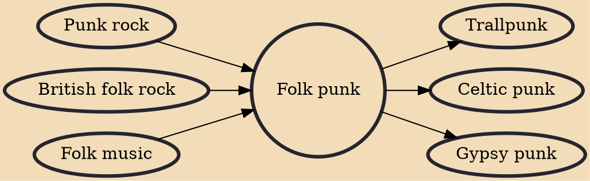

Folk punk (known in its early days as rogue folk) is a fusion of folk music and punk rock. It was popularized in the early 1980s by the Pogues in England, and by Violent Femmes in the United States. Folk punk achieved some mainstream success in that decade. In more recent years, its subgenres Celtic punk and Gypsy punk have experienced some commercial success.

## Influences
- [[Punk rock]]
- [[British folk rock]]
- [[Folk music]]

## Derivatives
- [[Trallpunk]]
- [[Celtic punk]]
- [[Gypsy punk]]
