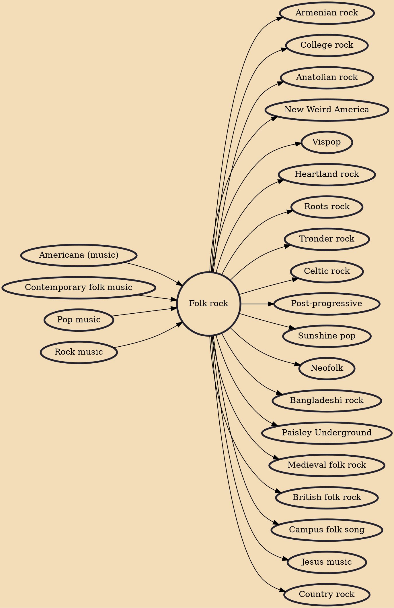

Folk rock is a hybrid music genre that combines the elements of folk and rock music, which arose in the United States, Canada, and the United Kingdom in the mid-1960s. In the U.S., folk rock emerged from the folk music revival. Performers such as Bob Dylan and the Byrds—several of whose members had earlier played in folk ensembles—attempted to blend the sounds of rock with their pre-existing folk repertoire, adopting the use of electric instrumentation and drums in a way previously discouraged in the U.S. folk community. The term "folk rock" was initially used in the U.S. music press in June 1965 to describe the Byrds' music.

## Influences

- [[Americana (music)]]
- [[Contemporary folk music]]
- [[Pop music]]
- [[Rock music]]

## Derivatives

- [[Armenian rock]]
- [[College rock]]
- [[Anatolian rock]]
- [[New Weird America]]
- [[Vispop]]
- [[Heartland rock]]
- [[Roots rock]]
- [[Trønder rock]]
- [[Celtic rock]]
- [[Post-progressive]]
- [[Sunshine pop]]
- [[Neofolk]]
- [[Bangladeshi rock]]
- [[Paisley Underground]]
- [[Medieval folk rock]]
- [[British folk rock]]
- [[Campus folk song]]
- [[Jesus music]]
- [[Country rock]]
