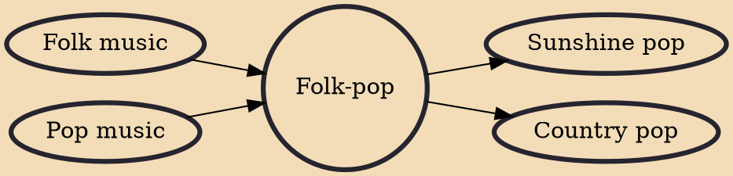

Folk-pop is a musical style that may be 1) contemporary folk songs with large, sweeping pop arrangements, or 2) pop songs with intimate, acoustic-based folk arrangements. Recording production values created a unblemished style that appealed to a mass audience, and thus led to commercial success as measured by high record sales, particularly as illustrated by hit records reaching the Top 40 on AM radio in the United States. Folk-pop developed during the 1960s folk music and folk rock boom. Key example of folk-pop artists include The Kingston Trio and Peter, Paul and Mary with contracts with major record labels (Capitol Records and Warner Brothers Records, respectively). The commercially successful artists stood in contrast to more politically charged and uncompromising folk music performers

## Influences

- [[Folk music]]
- [[Pop music]]

## Derivatives

- [[Sunshine pop]]
- [[Country pop]]
