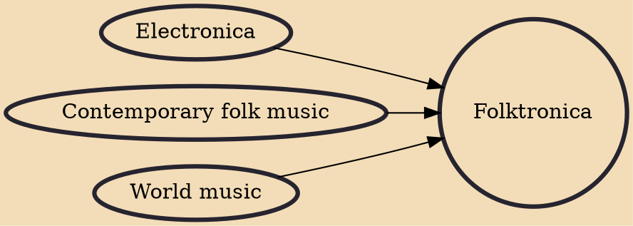

Folktronica is a genre of music comprising various elements of folk music and electronica, often featuring uses of acoustic instruments – especially stringed instruments – and incorporating hip hop, electronic or dance rhythms, although it varies based on influences and choice of sounds. The Ashgate Research Companion to Popular Musicology describes folktronica as "a catch-all [term] for all manner of artists who have combined mechanical dance beats with elements of acoustic rock or folk." .

## Influences

- [[Electronica]]
- [[Contemporary folk music]]
- [[World music]]
