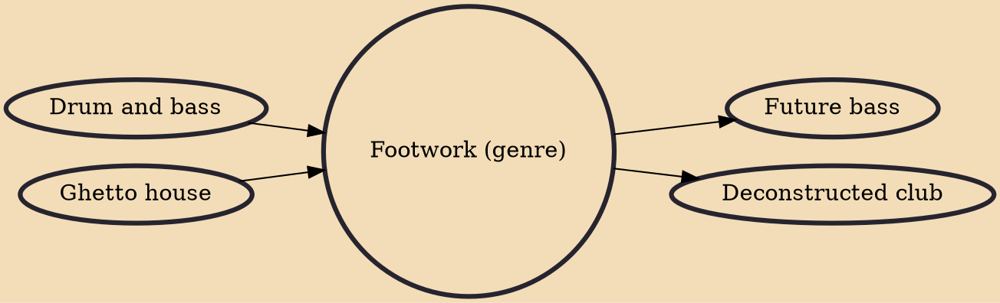

Footwork, also called juke, footwork/juke or Chicago juke, is a genre of electronic music derived from ghetto house with elements of hip hop, first appearing in Chicago in the late 1990s. The music style evolved from the earlier, rapid rhythms of ghetto house, a change pioneered by RP Boo. It may draw from the rapid rhythms and sub-bass frequencies of drum & bass. Tracks also frequently feature heavily syncopated samples from rap, pop and other sources, and are often around 160 bpm.

## Influences

- [[Drum and bass]]
- [[Ghetto house]]

## Derivatives

- [[Future bass]]
- [[Deconstructed club]]
