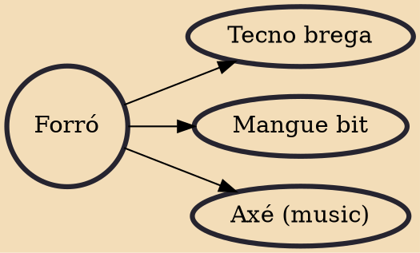

The term forró (Portuguese pronunciation: [fɔˈʁɔ]\*) refers to a musical genre, a rhythm, a dance and the event itself where forró music is played and danced. Forró is an important part of the culture of the Northeastern Region of Brazil. It encompasses various dance types as well as a number of different musical genres. Their music genres and dances have gained widespread popularity in all regions of Brazil, especially during the Brazilian June Festivals. Forró has also become increasingly popular all over the world, with a well-established forró scene in Europe.

## Derivatives

- [[Tecno brega]]
- [[Mangue bit]]
- [[Axé (music)]]
