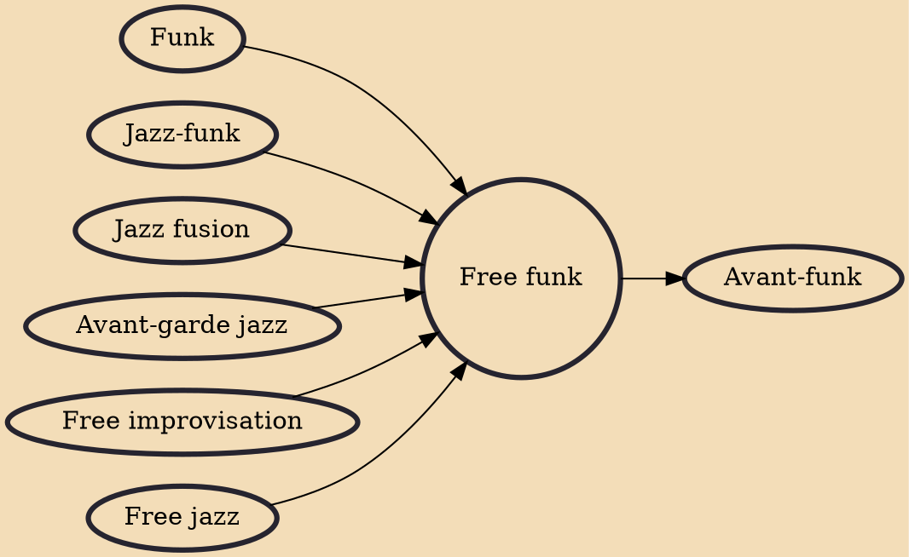

Free-funk is a combination of avant-garde jazz with funk music that developed in the 1970s. Leaders of the genre include Ornette Coleman and his Prime Time group, Ronald Shannon Jackson and his group Decoding Society, Jamaaladeen Tacuma and his group Spectacle and James "Blood" Ulmer. The music has also been quite influential on the M-Base genre.

## Influences
- [[Funk]]
- [[Jazz-funk]]
- [[Jazz fusion]]
- [[Avant-garde jazz]]
- [[Free improvisation]]
- [[Free jazz]]

## Derivatives
- [[Avant-funk]]
