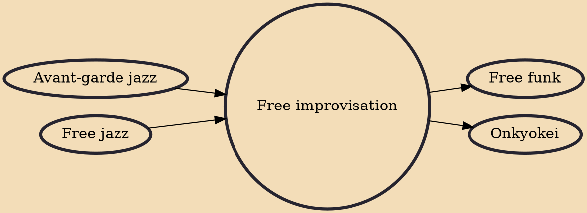

Free improvisation or free music is improvised music without any rules beyond the logic or inclination of the musician(s) involved. The term can refer to both a technique (employed by any musician in any genre) and as a recognizable genre in its own right.

## Influences

- [[Avant-garde jazz]]
- [[Free jazz]]

## Derivatives

- [[Free funk]]
- [[Onkyokei]]
