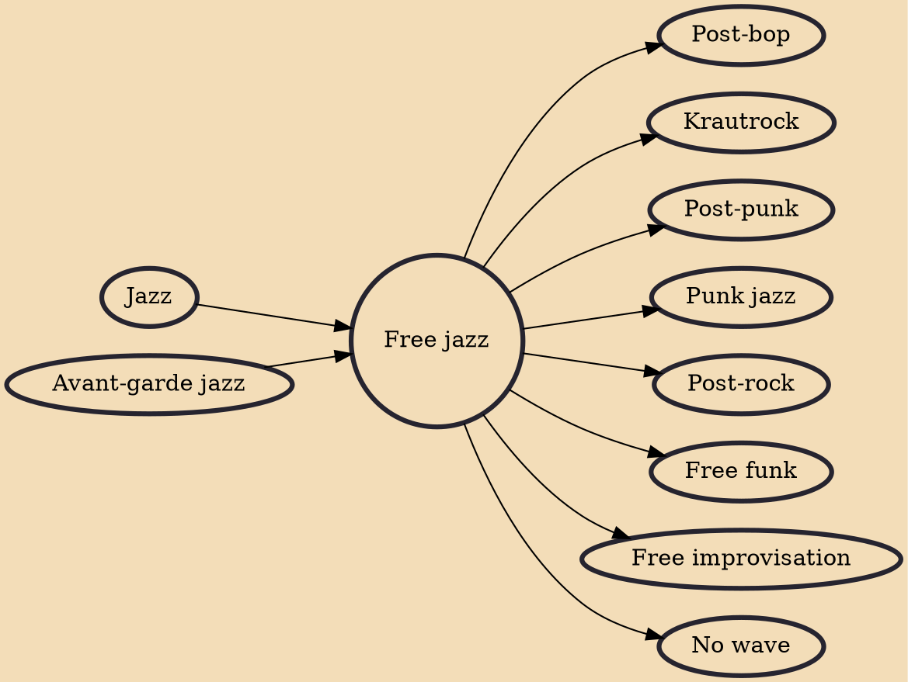

Free jazz is an experimental approach to jazz improvisation that developed in the late 1950s and early 1960s when musicians attempted to change or break down jazz conventions, such as regular tempos, tones, and chord changes. Musicians during this period believed that the bebop, hard bop, and modal jazz that had been played before them was too limiting. They became preoccupied with creating something new and exploring new directions. The term "free jazz" has often been combined with or substituted for the term "avant-garde jazz". Europeans tend to favor the term "free improvisation". Others have used "modern jazz", "creative music", and "art music".

## Influences
- [[Jazz]]
- [[Avant-garde jazz]]

## Derivatives
- [[Post-bop]]
- [[Krautrock]]
- [[Post-punk]]
- [[Punk jazz]]
- [[Post-rock]]
- [[Free funk]]
- [[Free improvisation]]
- [[No wave]]
