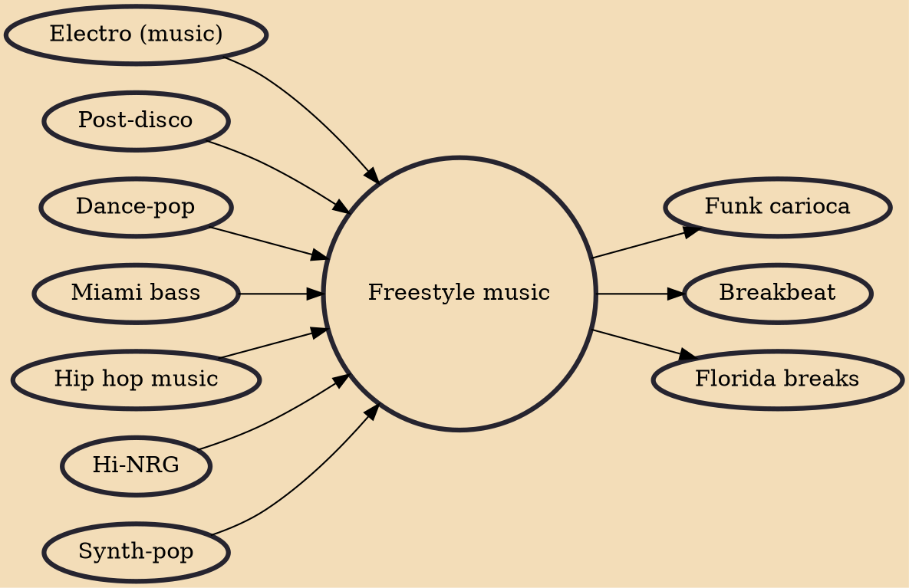

Freestyle music, also called Latin freestyle or Latin hip-hop (sic) is a form of electronic dance music that emerged in the New York metropolitan area and Philadelphia, primarily among Hispanic Americans and Italian Americans in the 1980s. It experienced its greatest popularity from the late 1980s until the early 1990s. A common theme of freestyle lyricism originated as heartbreak in an urban environment typified by New York City.

## Influences

- [[Electro (music)]]
- [[Post-disco]]
- [[Dance-pop]]
- [[Miami bass]]
- [[Hip hop music]]
- [[Hi-NRG]]
- [[Synth-pop]]

## Derivatives

- [[Funk carioca]]
- [[Breakbeat]]
- [[Florida breaks]]
