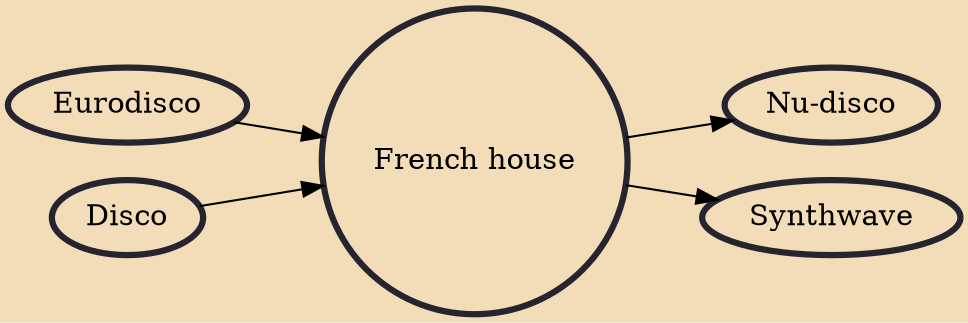

French house, also known as French touch, filter house and tekfunk, is a style of house music originally produced by French musicians in the 1990s. It is a form of Euro disco and a popular strand of the late 1990s and 2000s European dance music scene. The defining characteristics of the sound are reliant on filter and phaser effects both on and alongside samples from late 1970s and early 1980s American or European disco tracks (or original hooks strongly inspired by such samples), causing thicker harmonic foundations than the genre's forerunners. Most tracks in this genre are in 44 time and feature steady four on the floor beats in the tempo range of 110–130 beats per minute. French house is similar to future funk, although there are some key differences. Purveyors of French house include

## Influences

- [[Eurodisco]]
- [[Disco]]

## Derivatives

- [[Nu-disco]]
- [[Synthwave]]
