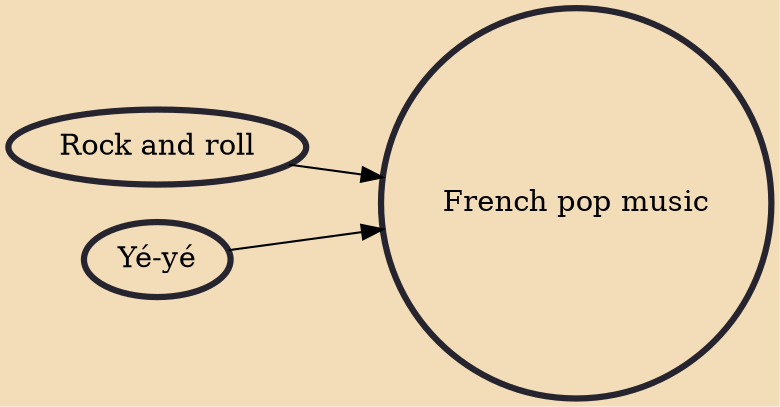

French pop music is pop music sung in the French language. It is usually performed by singers from France, Canada, Belgium, Switzerland, or any of the other francophone areas of the world. The target audience is the francophone market (primarily France), which is considerably smaller than and largely independent from the mainstream anglophone market.

## Influences
- [[Rock and roll]]
- [[Yé-yé]]
