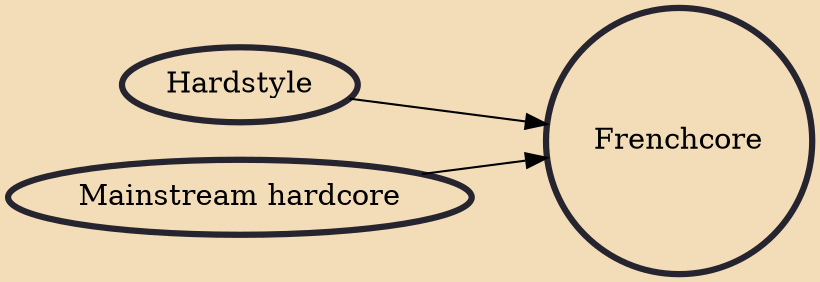

Frenchcore is a subgenre of hardcore techno. The style differs from other forms of hardcore in terms of a faster tempo, usually above 190-250 BPM, and a loud & distorted offbeat bassline. In the 1990s, drum machines and samplers were used to make this style. As technology developed, DAWs such as Ableton and Cubase became the standard for production. Modern frenchcore is often performed with live musical performers and sampling alongside a DJ set.

## Influences
- [[Hardstyle]]
- [[Mainstream hardcore]]
