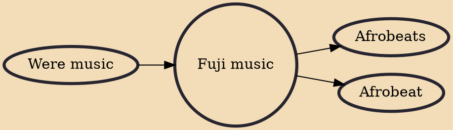

Fújì is a popular Yoruba musical genre. It arose from the improvisational wéré music, also known as ajísari (meaning "waking up for sari"), a genre of music performed to wake Muslims before dawn during the Ramadan fasting season. Alhaji Sikiru Ayinde Barrister popularized wéré music during the 1950s and 60s and conceived the term "fújì" in an unusual way. According to Barrister, "I came up with it when I saw a poster at an airport, advertising the Mount Fuji, which is the highest peak in Japan." Fújì should not be mistaken for the Yorùbá words "fuja" or "faaji," which mean leisure or enjoyment.

## Influences
- [[Were music]]

## Derivatives
- [[Afrobeats]]
- [[Afrobeat]]
