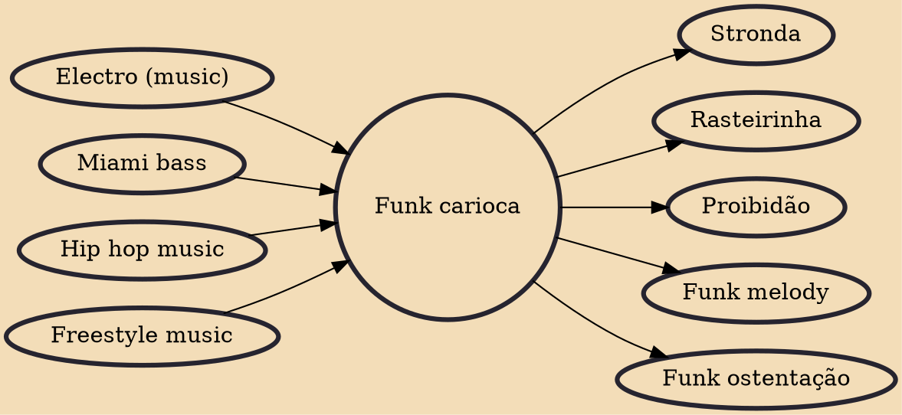

Funk carioca ([ˈfɐ̃.k(i) ˌkɐ.ɾi.ˈɔ.kɐ]), also known as favela funk and, in other parts in the world, baile funk and Brazilian funk, or even simply funk, is a hip hop-influenced style from Rio de Janeiro, blending funk with rap subgenres Miami bass and gangsta rap.

## Influences

- [[Electro (music)]]
- [[Miami bass]]
- [[Hip hop music]]
- [[Freestyle music]]

## Derivatives

- [[Stronda]]
- [[Rasteirinha]]
- [[Proibidão]]
- [[Funk melody]]
- [[Funk ostentação]]
