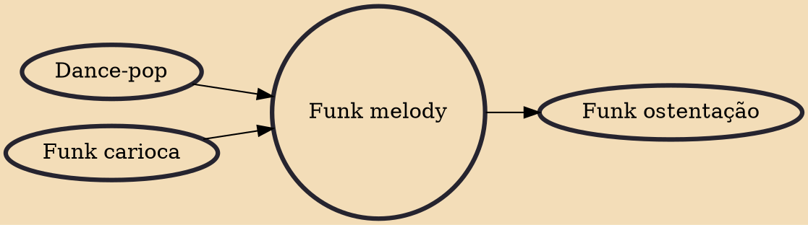

```dot
digraph {
	graph [bgcolor="#F3DDB8" rankdir=LR]
	node [color="#26242F" penwidth=3.0]
	"Funk melody" [shape=circle]
	"Dance-pop" [URL="/dance-pop/"]
	"Dance-pop" -> "Funk melody"
	"Funk carioca" [URL="/funk-carioca/"]
	"Funk carioca" -> "Funk melody"
	"Funk ostentação" [URL="/funk-ostentacao/"]
	"Funk melody" -> "Funk ostentação"
}
```

Funk melody is a fusion genre of funk carioca and Latin freestyle.

## Influences

- [[Dance-pop]]
- [[Funk carioca]]

## Derivatives

- [[Funk ostentação]]
