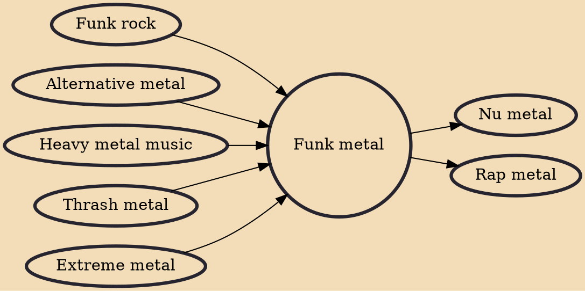

Funk metal (also known as thrash-funk or punk-funk) is a subgenre of funk rock and alternative metal that infuses heavy metal music (often thrash metal) with elements of funk and punk rock. Funk metal was part of the alternative metal movement, and has been described as a "brief but extremely media-hyped stylistic fad".

## Influences

- [[Funk rock]]
- [[Alternative metal]]
- [[Heavy metal music]]
- [[Thrash metal]]
- [[Extreme metal]]

## Derivatives

- [[Nu metal]]
- [[Rap metal]]
