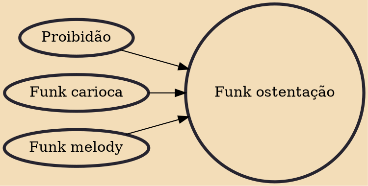

Funk ostentação (from Portuguese: Ostentation funk), is a Brazilian music style created in São Paulo in 2008. The central theme addressed in the songs is conspicuous consumption, and many funk ostentação artists sing about cars, motorcycles, drink, women, and ambitions to leave the favela and achieve life goals. Funk ostentação became strongly associated with the emerging (new middle class) in Brazil, whose financial status was improving along with that of principal funk ostentação artists like MC Guimê, MC Lon, and MC Pocahontas.

## Influences
- [[Proibidão]]
- [[Funk carioca]]
- [[Funk melody]]
