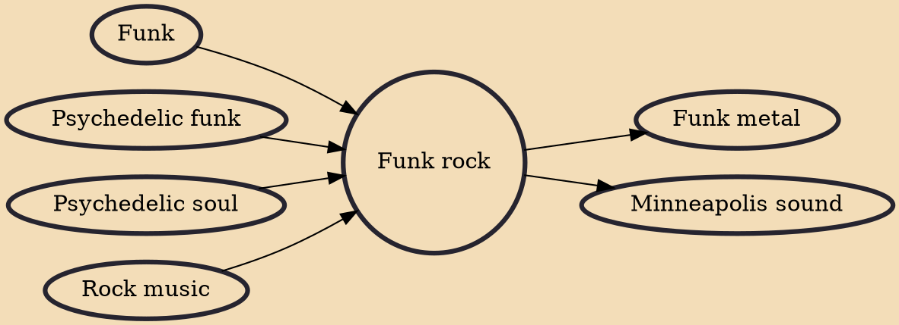

Funk rock is a fusion genre that mixes elements of funk and rock. James Brown and others declared that Little Richard and his mid-1950s road band, The Upsetters, were the first to put the funk in the rock and roll beat, with a biographer stating that their music "spark[ed] the musical transition from fifties rock and roll to sixties funk."

## Influences
- [[Funk]]
- [[Psychedelic funk]]
- [[Psychedelic soul]]
- [[Rock music]]

## Derivatives
- [[Funk metal]]
- [[Minneapolis sound]]
