```dot
digraph {
	graph [bgcolor="#F3DDB8" rankdir=LR]
	node [color="#26242F" penwidth=3.0]
	Funk [shape=circle]
	"Memphis soul" [URL="/memphis-soul/"]
	"Memphis soul" -> Funk
	"Rhythm and blues" [URL="/rhythm-and-blues/"]
	"Rhythm and blues" -> Funk
	"Gospel music" [URL="/gospel-music/"]
	"Gospel music" -> Funk
	Jazz [URL="/jazz/"]
	Jazz -> Funk
	"Soul music" [URL="/soul-music/"]
	"Soul music" -> Funk
	"New Orleans Soul" [URL="/new-orleans-soul/"]
	"New Orleans Soul" -> Funk
	"Outline of jazz" [URL="/outline-of-jazz/"]
	"Outline of jazz" -> Funk
	"Ball culture" [URL="/ball-culture/"]
	Funk -> "Ball culture"
	"West Coast hip hop" [URL="/west-coast-hip-hop/"]
	Funk -> "West Coast hip hop"
	"Smooth soul" [URL="/smooth-soul/"]
	Funk -> "Smooth soul"
	"Afro/cosmic music" [URL="/afrocosmic-music/"]
	Funk -> "Afro/cosmic music"
	"Contemporary R&B" [URL="/contemporary-rb/"]
	Funk -> "Contemporary R&B"
	"East Coast hip hop" [URL="/east-coast-hip-hop/"]
	Funk -> "East Coast hip hop"
	"Soca music" [URL="/soca-music/"]
	Funk -> "Soca music"
	"Australian hip hop" [URL="/australian-hip-hop/"]
	Funk -> "Australian hip hop"
	"Old-school hip hop" [URL="/old-school-hip-hop/"]
	Funk -> "Old-school hip hop"
	"Hip hop music" [URL="/hip-hop-music/"]
	Funk -> "Hip hop music"
	"Jazz-funk" [URL="/jazz-funk/"]
	Funk -> "Jazz-funk"
	Krautrock [URL="/krautrock/"]
	Funk -> Krautrock
	"Leeds hip hop" [URL="/leeds-hip-hop/"]
	Funk -> "Leeds hip hop"
	"Mangue bit" [URL="/mangue-bit/"]
	Funk -> "Mangue bit"
	"Progressive soul" [URL="/progressive-soul/"]
	Funk -> "Progressive soul"
	"Deep funk" [URL="/deep-funk/"]
	Funk -> "Deep funk"
	Disco [URL="/disco/"]
	Funk -> Disco
	Makossa [URL="/makossa/"]
	Funk -> Makossa
	"Liquid funk" [URL="/liquid-funk/"]
	Funk -> "Liquid funk"
	"Sri Lankan hip hop" [URL="/sri-lankan-hip-hop/"]
	Funk -> "Sri Lankan hip hop"
	"Free funk" [URL="/free-funk/"]
	Funk -> "Free funk"
	"Urban Pasifika" [URL="/urban-pasifika/"]
	Funk -> "Urban Pasifika"
	"Funk rock" [URL="/funk-rock/"]
	Funk -> "Funk rock"
	"Post-punk" [URL="/post-punk/"]
	Funk -> "Post-punk"
	"Brit funk" [URL="/brit-funk/"]
	Funk -> "Brit funk"
	"Yacht rock" [URL="/yacht-rock/"]
	Funk -> "Yacht rock"
	"Jazz fusion" [URL="/jazz-fusion/"]
	Funk -> "Jazz fusion"
	"Hip hop music in the Pacific Northwest" [URL="/hip-hop-music-in-the-pacific-northwest/"]
	Funk -> "Hip hop music in the Pacific Northwest"
	"Hip hop tuga" [URL="/hip-hop-tuga/"]
	Funk -> "Hip hop tuga"
	"Manila sound" [URL="/manila-sound/"]
	Funk -> "Manila sound"
	"Psychedelic funk" [URL="/psychedelic-funk/"]
	Funk -> "Psychedelic funk"
	"Avant-funk" [URL="/avant-funk/"]
	Funk -> "Avant-funk"
	"Philadelphia soul" [URL="/philadelphia-soul/"]
	Funk -> "Philadelphia soul"
	"Jungle music" [URL="/jungle-music/"]
	Funk -> "Jungle music"
	"Acid jazz" [URL="/acid-jazz/"]
	Funk -> "Acid jazz"
	"Electro (music)" [URL="/electro-music/"]
	Funk -> "Electro (music)"
	Chillwave [URL="/chillwave/"]
	Funk -> Chillwave
	"Alternative hip hop" [URL="/alternative-hip-hop/"]
	Funk -> "Alternative hip hop"
	"G-funk" [URL="/g-funk/"]
	Funk -> "G-funk"
	"Shibuya-kei" [URL="/shibuya-kei/"]
	Funk -> "Shibuya-kei"
	"Go-go" [URL="/go-go/"]
	Funk -> "Go-go"
	"Funky house" [URL="/funky-house/"]
	Funk -> "Funky house"
	Funkstep [URL="/funkstep/"]
	Funk -> Funkstep
	Tropipop [URL="/tropipop/"]
	Funk -> Tropipop
	"Dance-punk" [URL="/dance-punk/"]
	Funk -> "Dance-punk"
	"Swamp rock" [URL="/swamp-rock/"]
	Funk -> "Swamp rock"
	"No wave" [URL="/no-wave/"]
	Funk -> "No wave"
	"Teen pop" [URL="/teen-pop/"]
	Funk -> "Teen pop"
	Neurofunk [URL="/neurofunk/"]
	Funk -> Neurofunk
	Breakbeat [URL="/breakbeat/"]
	Funk -> Breakbeat
	Afrobeat [URL="/afrobeat/"]
	Funk -> Afrobeat
	"City pop" [URL="/city-pop/"]
	Funk -> "City pop"
	"Samba rock" [URL="/samba-rock/"]
	Funk -> "Samba rock"
	"Reggae fusion" [URL="/reggae-fusion/"]
	Funk -> "Reggae fusion"
	Skweee [URL="/skweee/"]
	Funk -> Skweee
	"New jack swing" [URL="/new-jack-swing/"]
	Funk -> "New jack swing"
}
```

Funk is a music genre that originated in African American communities in the mid-1960s when musicians created a rhythmic, danceable new form of music through a mixture of various music genres that were popular among African Americans in the mid-20th century. It de-emphasizes melody and chord progressions and focuses on a strong rhythmic groove of a bassline played by an electric bassist and a drum part played by a percussionist, often at slower tempos than other popular music. Funk typically consists of a complex percussive groove with rhythm instruments playing interlocking grooves that create a "hypnotic" and "danceable" feel. Funk uses the same richly colored extended chords found in bebop jazz, such as minor chords with added sevenths and elevenths, or dominant seventh chords with alte

## Influences
- [[Memphis soul]]
- [[Rhythm and blues]]
- [[Gospel music]]
- [[Jazz]]
- [[Soul music]]
- [[New Orleans Soul]]
- [[Outline of jazz]]

## Derivatives
- [[Ball culture]]
- [[West Coast hip hop]]
- [[Smooth soul]]
- [[Afro/cosmic music]]
- [[Contemporary R&B]]
- [[East Coast hip hop]]
- [[Soca music]]
- [[Australian hip hop]]
- [[Old-school hip hop]]
- [[Hip hop music]]
- [[Jazz-funk]]
- [[Krautrock]]
- [[Leeds hip hop]]
- [[Mangue bit]]
- [[Progressive soul]]
- [[Deep funk]]
- [[Disco]]
- [[Makossa]]
- [[Liquid funk]]
- [[Sri Lankan hip hop]]
- [[Free funk]]
- [[Urban Pasifika]]
- [[Funk rock]]
- [[Post-punk]]
- [[Brit funk]]
- [[Yacht rock]]
- [[Jazz fusion]]
- [[Hip hop music in the Pacific Northwest]]
- [[Hip hop tuga]]
- [[Manila sound]]
- [[Psychedelic funk]]
- [[Avant-funk]]
- [[Philadelphia soul]]
- [[Jungle music]]
- [[Acid jazz]]
- [[Electro (music)]]
- [[Chillwave]]
- [[Alternative hip hop]]
- [[G-funk]]
- [[Shibuya-kei]]
- [[Go-go]]
- [[Funky house]]
- [[Funkstep]]
- [[Tropipop]]
- [[Dance-punk]]
- [[Swamp rock]]
- [[No wave]]
- [[Teen pop]]
- [[Neurofunk]]
- [[Breakbeat]]
- [[Afrobeat]]
- [[City pop]]
- [[Samba rock]]
- [[Reggae fusion]]
- [[Skweee]]
- [[New jack swing]]
