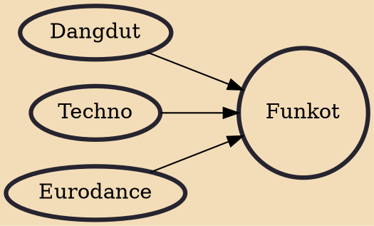

Funkot (an abbreviation from Funky Kota) is an electronic dance music genre from Indonesia that emerged from the 1990s. This music is a mix of House music with a tempo of 160 to 220 bpm (beats per minute). There are many other names for this genre, namely "Hardfunk", "House Kota", "Indonesian House", and "Indonesian Hardcore".

## Influences
- [[Dangdut]]
- [[Techno]]
- [[Eurodance]]
