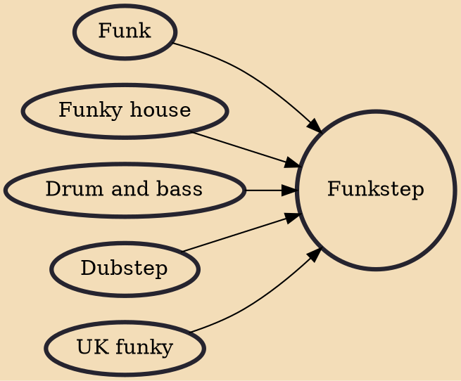

Funkstep (also known as dubbage) is a style of UK funky, incorporating elements of dubstep and sometimes drum and bass.

## Influences

- [[Funk]]
- [[Funky house]]
- [[Drum and bass]]
- [[Dubstep]]
- [[UK funky]]
