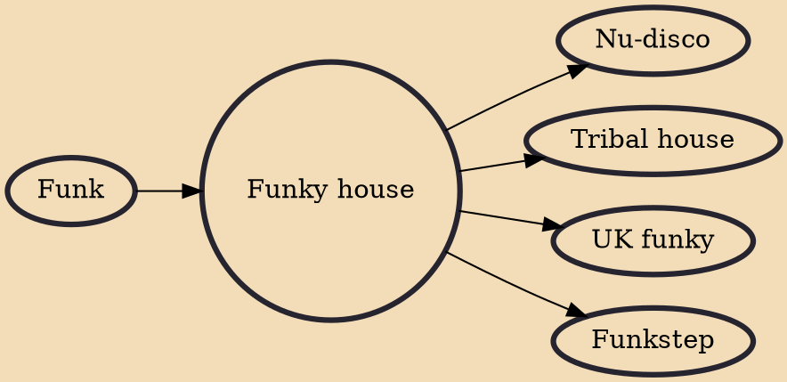

Funky house is a subgenre of house music that uses disco and funk samples, a funk-inspired bass line or a strong soul influence, combined with drum breaks that draw inspiration from 1970s and 1980s funk records. The use of disco strings are also common in the genre, although not always. Funky house uses specific techniques and a specific sound, characterized by bassline, swooshes, swirls and other synthesized sounds which give the music a bouncy tempo with around 128 BPM.

## Influences
- [[Funk]]

## Derivatives
- [[Nu-disco]]
- [[Tribal house]]
- [[UK funky]]
- [[Funkstep]]
