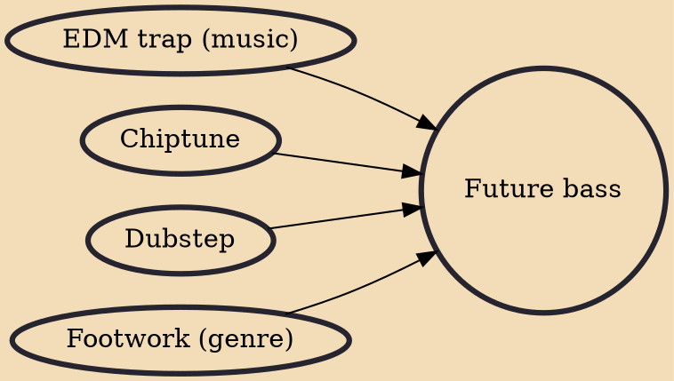

Future bass is a style of electronic dance music which developed in the 2010s that mixes elements of dubstep and trap with warmer, less abrasive rhythms. The genre was pioneered by producers such as Rustie, Hudson Mohawke, Lido, San Holo and Cashmere Cat, and it was popularised in the mid to late-2010s by artists such as Flume, Martin Garrix, Illenium, Louis the Child and Mura Masa. 2016 was seen as the breakout year for the genre.

## Influences
- [[EDM trap (music)]]
- [[Chiptune]]
- [[Dubstep]]
- [[Footwork (genre)]]
