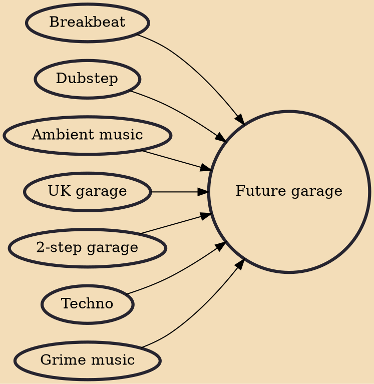

Future garage is a genre of electronic music that incorporates a variety of influences from UK garage and softer elements from 2-step garage, leading to an off-kilter rhythmic style. Characteristic sounds are pitched vocal chops, warm filtered reese basses, dark atmospheres (including synth pads, field recordings and other atmospheric sounds) and vinyl crackle. The tempo usually ranges from 130 to 140 bpm, but can also be slower or faster.

## Influences

- [[Breakbeat]]
- [[Dubstep]]
- [[Ambient music]]
- [[UK garage]]
- [[2-step garage]]
- [[Techno]]
- [[Grime music]]
