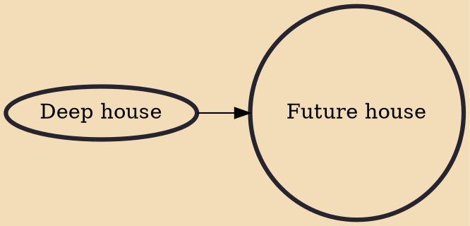

Future house is a house music genre that emerged in the 2010s in the United Kingdom, described as a fusion of deep house, UK garage and incorporating other elements and techniques of other EDM genres. It is high in energy, generally consisting of big drops, 4/4 beats and is sonically bass heavy.

## Influences

- [[Deep house]]
