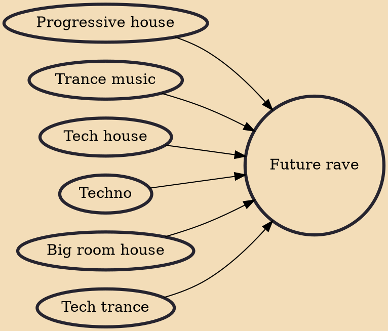

Future rave (also known as future techno) is a genre of EDM coined by deejay/producers David Guetta and Morten Breum. The sound is a dark yet electrifying blend of techno and progressive house. The pair have gone on a tour under the name future rave. The style has been popularized by other EDM artists such as Hardwell.

## Influences
- [[Progressive house]]
- [[Trance music]]
- [[Tech house]]
- [[Techno]]
- [[Big room house]]
- [[Tech trance]]
