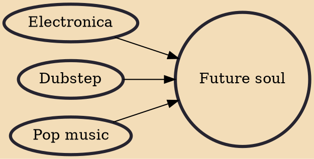

Future soul is a term often used by UK singer-songwriter Daley in the 2010s to describe a style of music that emerged from soul and contemporary R&B. Although both soulful and conscious, future soul is distinguished from neo soul as it infuses more elements of pop, electronica, dubstep and hip hop instead of jazz and funk. Simply put, future soul is soulful songwriting infused with forward thinking electronic production.

## Influences

- [[Electronica]]
- [[Dubstep]]
- [[Pop music]]
