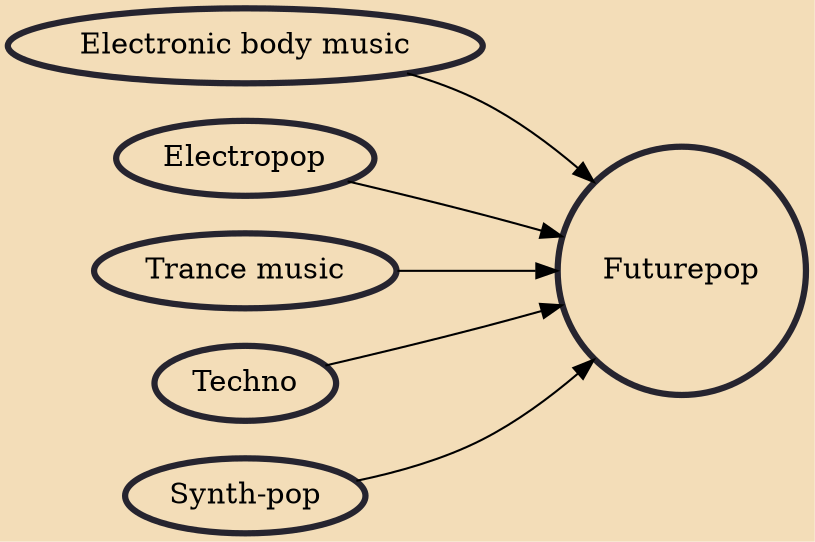

Futurepop is an electronic music genre that has been characterized as a blend of synthpop, EBM and dance beats, based on trance and techno. It developed in Western Europe as an outgrowth of both EBM and electro-industrial music cultures and it began to emerge in the late 1990s with artists like VNV Nation, Covenant, and Apoptygma Berzerk. Other leading genre artists were Assemblage 23, Icon of Coil, Neuroticfish, and Rotersand.

## Influences

- [[Electronic body music]]
- [[Electropop]]
- [[Trance music]]
- [[Techno]]
- [[Synth-pop]]
