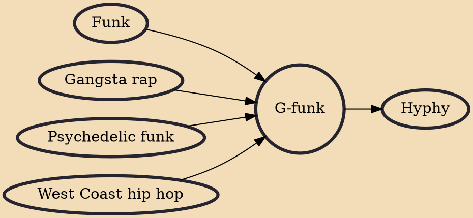

G-funk, short for gangsta funk, is a sub-genre of gangsta rap that emerged from the West Coast scene in the late 1980s. The genre is heavily influenced by 1970s psychedelic funk (P-funk) sound of artists such as Parliament-Funkadelic.

## Influences

- [[Funk]]
- [[Gangsta rap]]
- [[Psychedelic funk]]
- [[West Coast hip hop]]

## Derivatives

- [[Hyphy]]
