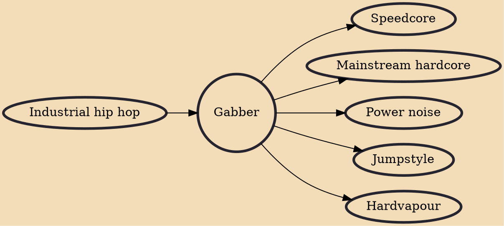

Gabber (/ˈɡæbər/; Dutch: [ˈxɑbər]) is a style of electronic dance music and a subgenre of hardcore, as well as the surrounding subculture. The music is more commonly referred to as Hardcore, which is characterised by fast beats, distorted & heavier kickdrums, with darker themes and samples, and was developed in Rotterdam and Amsterdam in the 1990s by producers like Marc Acardipane, Paul Elstak, DJ Rob, and The Prophet, forming record labels such as Rotterdam Records, Mokum Records, Pengo Records and Industrial Strength Records.

## Influences

- [[Industrial hip hop]]

## Derivatives

- [[Speedcore]]
- [[Mainstream hardcore]]
- [[Power noise]]
- [[Jumpstyle]]
- [[Hardvapour]]
