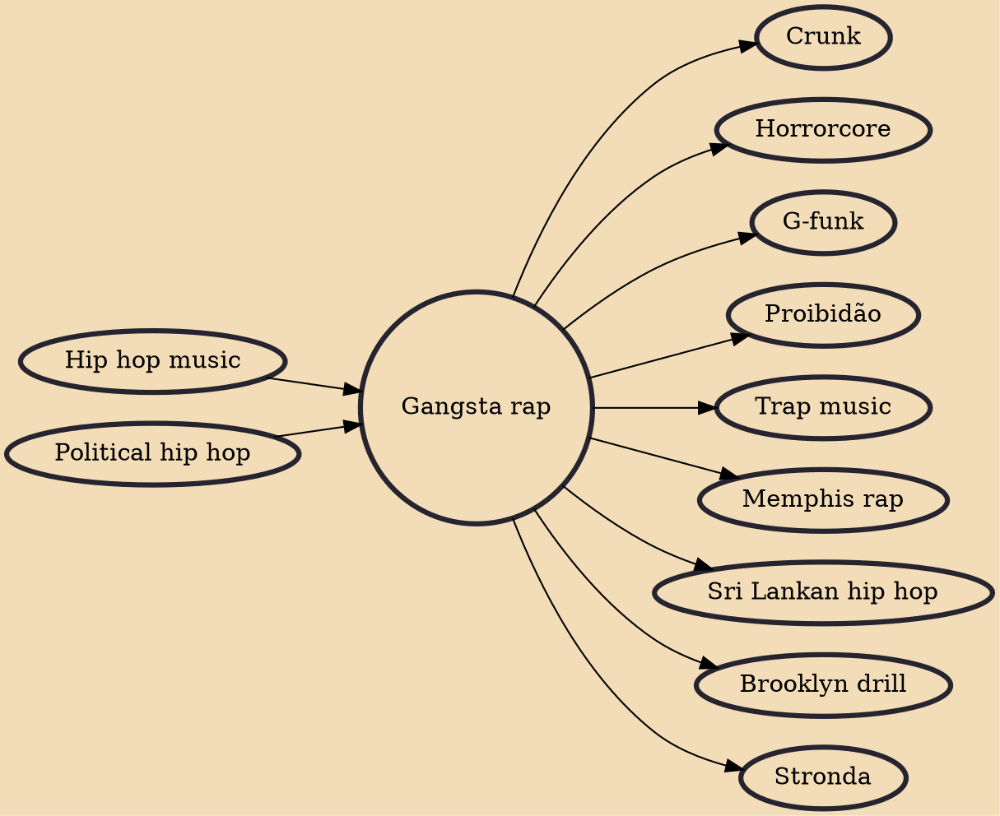

Gangsta rap or gangster rap, initially called reality rap, emerged in the mid- to late 1980s as a controversial hip-hop subgenre whose lyrics assert the culture and values typical of American street gangs and street hustlers. Many gangsta rappers flaunt associations with real street gangs, like the Crips and Bloods. Gangsta rap's pioneers were Schoolly D of Philadelphia in 1985, Ice-T of Los Angeles in 1986, and especially N.W.A in 1988. In 1992, via record producer Dr. Dre, rapper Snoop Dogg, and their G-funk sound, gangsta rap took the rap genre's lead and became mainstream, popular music.

## Influences

- [[Hip hop music]]
- [[Political hip hop]]

## Derivatives

- [[Crunk]]
- [[Horrorcore]]
- [[G-funk]]
- [[Proibidão]]
- [[Trap music]]
- [[Memphis rap]]
- [[Sri Lankan hip hop]]
- [[Brooklyn drill]]
- [[Stronda]]
