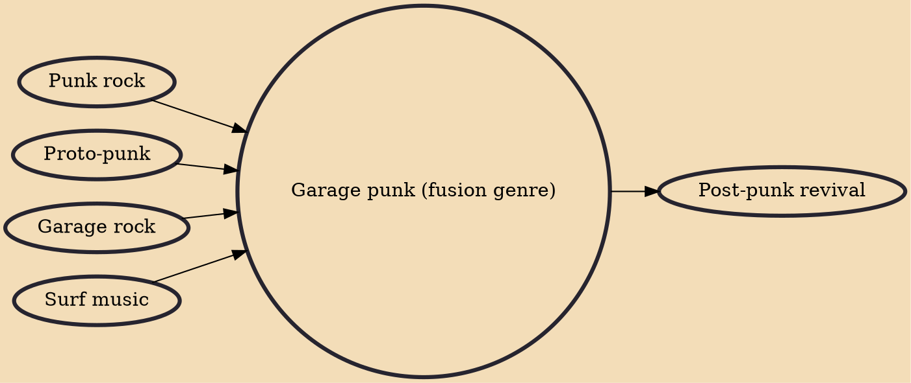

Garage punk is a rock music fusion genre combining the influences of garage rock, punk rock, and often other genres, that took shape in the indie rock underground between the late 1980s and early 1990s. Bands drew heavily from 1960s garage rock, stripped-down 1970s punk rock, and Detroit proto-punk, and often incorporated numerous other styles into their approach, such as power pop, 1960s girl groups, hardcore punk, blues and early R&B, and surf rock.

## Influences

- [[Punk rock]]
- [[Proto-punk]]
- [[Garage rock]]
- [[Surf music]]

## Derivatives

- [[Post-punk revival]]
