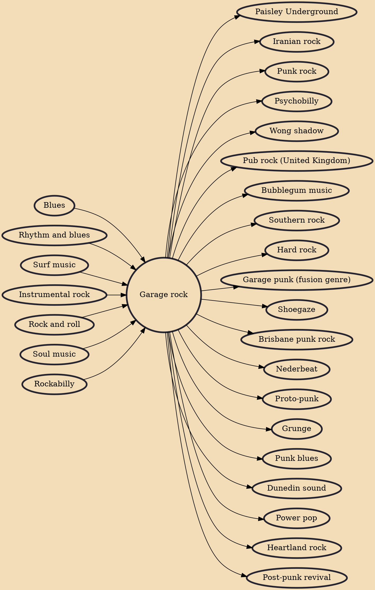

Garage rock (sometimes called garage punk or '60s punk) is a raw and energetic style of rock and roll that flourished in the mid-1960s, most notably in the United States and Canada, and has experienced a series of subsequent revivals. The style is characterized by basic chord structures played on electric guitars and other instruments, sometimes distorted through a fuzzbox, as well as often unsophisticated and occasionally aggressive lyrics and delivery. Its name derives from the perception that groups were often made up of young amateurs who rehearsed in the family garage, although many were professional.

## Influences
- [[Blues]]
- [[Rhythm and blues]]
- [[Surf music]]
- [[Instrumental rock]]
- [[Rock and roll]]
- [[Soul music]]
- [[Rockabilly]]

## Derivatives
- [[Paisley Underground]]
- [[Iranian rock]]
- [[Punk rock]]
- [[Psychobilly]]
- [[Wong shadow]]
- [[Pub rock (United Kingdom)]]
- [[Bubblegum music]]
- [[Southern rock]]
- [[Hard rock]]
- [[Garage punk (fusion genre)]]
- [[Shoegaze]]
- [[Brisbane punk rock]]
- [[Nederbeat]]
- [[Proto-punk]]
- [[Grunge]]
- [[Punk blues]]
- [[Dunedin sound]]
- [[Power pop]]
- [[Heartland rock]]
- [[Post-punk revival]]
