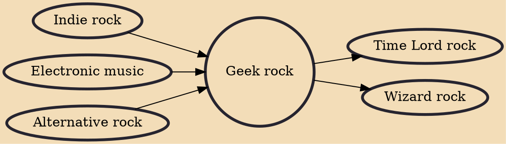

Geek rock (also known as nerd rock or dork rock) is a musical subgenre derived from pop rock and alternative rock within the nerd music group. It is a sister genre to the chiptune-influenced rock subgenre Nintendocore and related to other branches of nerd music such as hip hop's nerdcore and contemporary folk's nerd-folk. Geek rock is characterised by the standard instruments of rock music often combined with electronic and unusual instruments; references to geek culture and specialised, yet often mundane, interests; and an element of humour. Specific subgenres of geek rock range from those related to elements of geek culture, such as the Harry Potter–based wizard rock, and those related to elements of rock music, such as the punk rock variant called nerd punk.

## Influences

- [[Indie rock]]
- [[Electronic music]]
- [[Alternative rock]]

## Derivatives

- [[Time Lord rock]]
- [[Wizard rock]]
