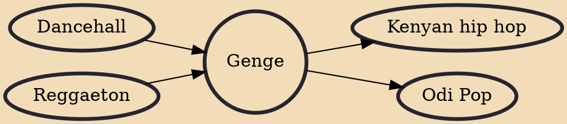

Genge music, or genge, is a genre of hip hop music with additional influences from dancehall music that has its beginnings in Nairobi, Kenya. The name was coined by the producer Clemo and popularized by Kenyan rappers Jua Cali and Nonini, who started off at Calif Records, and is commonly sung in Sheng (Swahili and English slang), Swahili or local dialects. The term Genge is a Sheng word for "a group or a mass of people".

## Influences
- [[Dancehall]]
- [[Reggaeton]]

## Derivatives
- [[Kenyan hip hop]]
- [[Odi Pop]]
