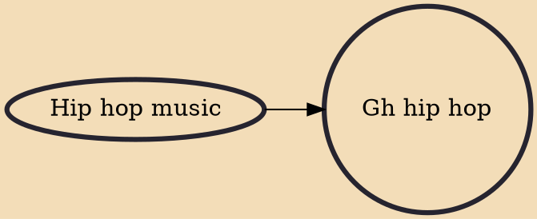

Gh hip hop, Gh rap or Ghana hip hop is a hip hop genre, subculture and art movement that developed in Ghana during the late 1990s. The hip-hop genre came into existence in Ghana through Reggie Rockstone, who is known as the hip-life father, and other notable musicians such as Jayso and Ball J. It first came to Ghana as Hiplife, where Reggie Rockstone introduced a fusion of hip-hop beats with African sounds to create a whole new genre.

## Influences
- [[Hip hop music]]
