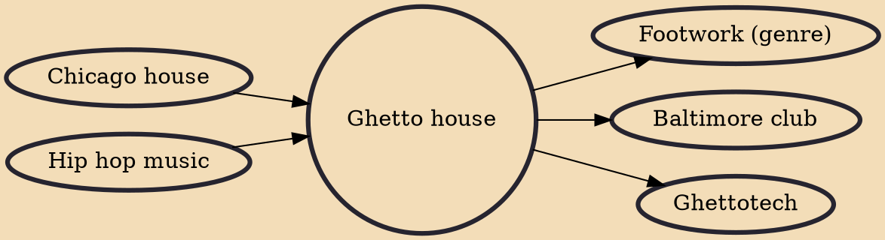

Ghetto house or booty house is a subgenre of house music which started being recognized as a distinct style from around 1992 onwards. It features minimal 808 and 909 drum machine-driven tracks and sometimes sexually explicit lyrics. Ghetto house music artists include: DJ Deeon, Jammin' Gerald, DJ Funk, DJ Milton, DJ Slugo, Waxmaster, Traxman, Parris Mitchell.

## Influences
- [[Chicago house]]
- [[Hip hop music]]

## Derivatives
- [[Footwork (genre)]]
- [[Baltimore club]]
- [[Ghettotech]]
