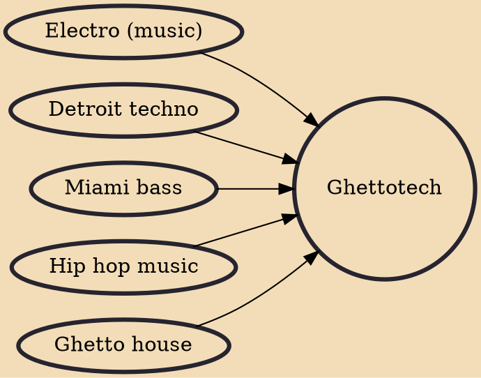

Ghettotech (also known as Detroit club) is a genre of electronic music originating from Detroit. It combines elements of Chicago's ghetto house with electro, Detroit techno, Miami bass.

## Influences
- [[Electro (music)]]
- [[Detroit techno]]
- [[Miami bass]]
- [[Hip hop music]]
- [[Ghetto house]]
