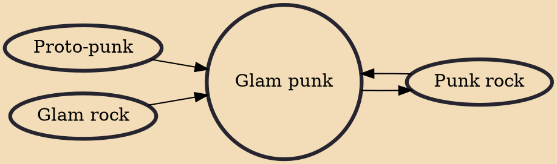

Glam punk is a term used retrospectively to describe a short-lived trend for bands which produced a form of proto-punk that incorporated elements of glam rock, initially in the early to mid-1970s.

## Influences
- [[Punk rock]]
- [[Proto-punk]]
- [[Glam rock]]

## Derivatives
- [[Punk rock]]
