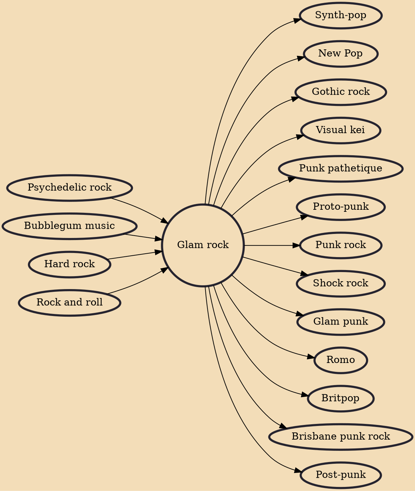

Glam rock is a style of rock music that developed in the United Kingdom in the early 1970s and was performed by musicians who wore outrageous costumes, makeup, and hairstyles, particularly platform shoes and glitter. Glam artists drew on diverse sources across music and throwaway pop culture, ranging from bubblegum pop and 1950s rock and roll to cabaret, science fiction, and complex art rock. The flamboyant clothing and visual styles of performers were often camp or androgynous, and have been described as playing with other gender roles. Glitter rock was a more extreme version of glam rock.

## Influences

- [[Psychedelic rock]]
- [[Bubblegum music]]
- [[Hard rock]]
- [[Rock and roll]]

## Derivatives

- [[Synth-pop]]
- [[New Pop]]
- [[Gothic rock]]
- [[Visual kei]]
- [[Punk pathetique]]
- [[Proto-punk]]
- [[Punk rock]]
- [[Shock rock]]
- [[Glam punk]]
- [[Romo]]
- [[Britpop]]
- [[Brisbane punk rock]]
- [[Post-punk]]
